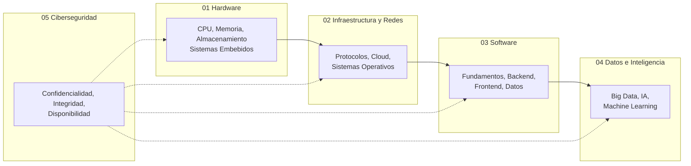

# Fundamentos del Software

[](LICENSE)
[](https://jupyter.org/)

Mapa de conocimiento atemporal sobre los fundamentos de la informática y la ingeniería del software. Desde la arquitectura de computadores hasta la industria del software, pasando por redes, cloud, bases de datos, inteligencia artificial y ciberseguridad.

> **Filosofía:** Este repositorio no depende de tecnologías concretas. No encontrarás tutoriales de frameworks pasajeros, sino los principios que subyacen a ellos y que seguirán siendo ciertos dentro de 10 años.

---

## Las 5 Capas + Industria

El software no existe en el vacío. Se sostiene sobre una pila de conceptos que arrancan en el hardware y terminan en la abstracción más pura.



La ciberseguridad es una capa transversal que aplica a todos los niveles.

---

## Contenidos

### [01 — Hardware](01_Hardware/)

| Notebook | Descripción |
|----------|-------------|
| [Arquitectura de Computadores](01_Hardware/01_Arquitectura_Computadores.ipynb) | Von Neumann, CPU, memoria jerárquica, pipeline, GPU |

### [02 — Infraestructura y Redes](02_Infraestructura_Redes/)

| Notebook | Descripción |
|----------|-------------|
| [Redes y Protocolos](02_Infraestructura_Redes/01_Redes_Protocolos.ipynb) | Modelo OSI, TCP/IP, DNS, HTTP, UDP, NAT |
| [Cloud Computing](02_Infraestructura_Redes/02_Cloud_Computing.ipynb) | IaaS, PaaS, SaaS, FaaS, escalabilidad, elasticidad |
| [Sistemas Operativos](02_Infraestructura_Redes/03_Sistemas_Operativos.ipynb) | Procesos, scheduling, memoria virtual, syscalls |

### [03 — Software](03_Software/)

#### Fundamentos y Metodologías

| Notebook | Descripción |
|----------|-------------|
| [SDLC](03_Software/01_Fundamentos_Metodologias/01_SDLC.ipynb) | Ciclo de vida del software, Waterfall vs Iterativo |
| [Diseño UML](03_Software/01_Fundamentos_Metodologias/02_Diseno_UML.ipynb) | Casos de uso, clases, secuencia, actividad, estados |
| [Principios de Desarrollo](03_Software/01_Fundamentos_Metodologias/03_Principios_Desarrollo.ipynb) | SOLID, DRY, KISS, YAGNI, composición vs herencia |
| [Arquitecturas Software](03_Software/01_Fundamentos_Metodologias/04_Arquitecturas_Software.ipynb) | Monolito, microservicios, hexagonal, CQRS, event sourcing |
| [Control de Versiones](03_Software/01_Fundamentos_Metodologias/05_Control_Versiones.ipynb) | Git, branching, merges, GitFlow, trunk-based |
| [Metodologías Ágiles](03_Software/01_Fundamentos_Metodologias/06_Metodologias_Agiles.ipynb) | Manifiesto Ágil, Scrum, Kanban |

#### Backend y Datos

| Notebook | Descripción |
|----------|-------------|
| [Bases de Datos](03_Software/02_Backend_Datos/01_Bases_Datos_Conceptual.ipynb) | SQL vs NoSQL, ACID vs BASE, CAP, normalización |
| [APIs](03_Software/02_Backend_Datos/02_APIs.ipynb) | REST, GraphQL, gRPC, versionado, autenticación |
| [Lenguajes y Paradigmas](03_Software/02_Backend_Datos/03_Lenguajes_Paradigmas.ipynb) | OOP, funcional, tipado, compilado vs interpretado, memoria |

#### Frontend

| Notebook | Descripción |
|----------|-------------|
| [Web Fundamentos](03_Software/03_Frontend/01_Web_Fundamentos.ipynb) | Cliente-servidor, HTML/CSS/JS, DOM, HTTP, storage |
| [UX/UI](03_Software/03_Frontend/02_UX_UI.ipynb) | UX vs UI, heurísticas de Nielsen, accesibilidad, prototipado |

### [04 — Datos e Inteligencia](04_Datos_Inteligencia/)

| Notebook | Descripción |
|----------|-------------|
| [Datos y Big Data](04_Datos_Inteligencia/01_Datos_Big_Data.ipynb) | 5 V's, batch vs streaming, Lambda/Kappa, ETL, data lakes |
| [IA y Machine Learning](04_Datos_Inteligencia/02_IA_ML.ipynb) | Supervisado/no supervisado, deep learning, LLMs, transformers |

### [05 — Ciberseguridad](05_Ciberseguridad/)

| Notebook | Descripción |
|----------|-------------|
| [Fundamentos de Ciberseguridad](05_Ciberseguridad/01_Fundamentos_Ciberseguridad.ipynb) | Tríada CIA, criptografía, amenazas, defensa en profundidad |

### [06 — Industria del Software](06_Industria_Software/)

| Notebook | Descripción |
|----------|-------------|
| [Áreas y Disciplinas](06_Industria_Software/01_Areas_Disciplinas.ipynb) | Web, móvil, escritorio, videojuegos, IoT, blockchain |
| [Roles y Sectores](06_Industria_Software/02_Roles_Sectores.ipynb) | Perfiles, sectores (FinTech, HealthTech, EdTech...) |
| [Estudios y Certificaciones](06_Industria_Software/03_Estudios_Certificaciones.ipynb) | FP, universidad, masters, certificaciones profesionales |

---

## Cómo navegar

1. **Empieza por abajo**: si no entiendes cómo funciona una CPU, los conceptos de alto nivel se te escaparán. Sigue el orden: 01 → 02 → 03 → 04.
2. **Ciberseguridad** (05) léela en paralelo: cada concepto de las capas 01-04 tiene implicaciones de seguridad.
3. **Industria** (06) es un mapa del mundo laboral. Consúltalo para contextualizar tu aprendizaje.
4. **Cada notebook es independiente**, pero están ordenados por dependencia conceptual.

---

## Requisitos

- Un navegador web moderno para ver los notebooks directamente en [GitHub](https://github.com/lucaschacon3/Fundamentos_Informatica).
- Opcional: [Jupyter Notebook](https://jupyter.org/) o [VS Code](https://code.visualstudio.com/) con la extensión de Jupyter para abrir los archivos `.ipynb` localmente.

---

## Herramientas

El directorio [`_tools/`](_tools/) contiene un script para generar notebooks de Jupyter a partir de un formato Markdown simplificado:

```bash
python _tools/notebook_builder.py ruta/al/output.ipynb < fuente.md
```

---

## Contribuciones

Las contribuciones son bienvenidas. Si encuentras un error, algo desactualizado o quieres proponer una mejora:

1. Abre un [issue](https://github.com/lucaschacon3/Fundamentos_Informatica/issues)
2. O envía un [pull request](https://github.com/lucaschacon3/Fundamentos_Informatica/pulls)

---

## Licencia

Este proyecto está bajo la licencia MIT. Consulta el archivo [LICENSE](LICENSE) para más detalles.
